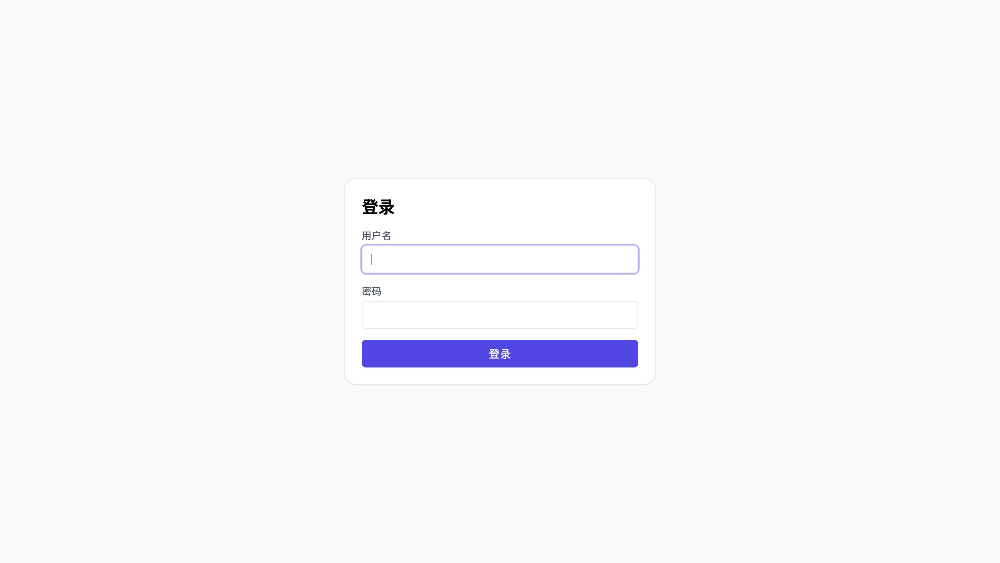
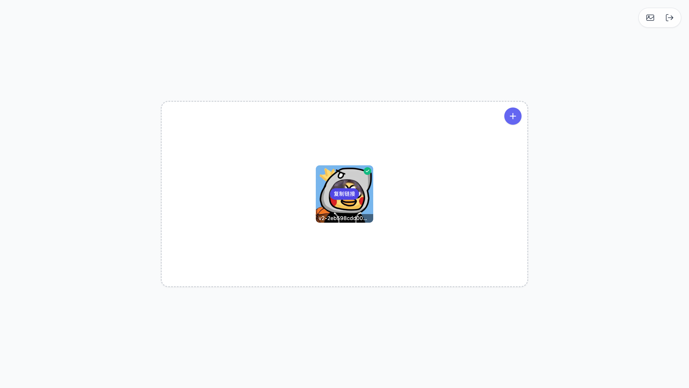

# 📸 CF-TG-Host

> 基于 Cloudflare Pages + Telegram Bot API 的免费图片托管服务

一个现代化的图片托管解决方案，利用 Telegram 作为免费存储后端，通过 Cloudflare Pages 提供快速、可靠的图片访问服务。

## ✨ 特性

### 🚀 核心功能

- **免费托管** - 利用 Telegram 的免费存储空间
- **全球 CDN** - Cloudflare 全球边缘网络加速
- **无限容量** - 受 Telegram 存储限制（实际上几乎无限）
- **高速访问** - 智能缓存 + 边缘计算优化
- **安全可靠** - 严格的防盗链保护

### 🎨 用户界面

- **现代化设计** - React + TypeScript + Tailwind CSS
- **响应式布局** - 完美适配手机、平板、桌面
- **瀑布流展示** - 纯 CSS Columns 实现，性能卓越
- **无限滚动** - 流畅的浏览体验

### 🔒 安全特性

- **防盗链保护** - 基于 Referer 的访问控制
- **管理员认证** - 安全的后台管理
- **缓存控制** - 智能缓存策略
- **访问日志** - 完整的访问记录

## 📱 界面展示

### 🔐 登录界面



简洁的管理员认证界面，保障系统安全

### 🏠 首页 - 图片上传界面



拖拽上传、批量处理、实时进度显示

### 🖼️ 图片库 - 瀑布流展示


响应式瀑布流布局，完美适配各种屏幕尺寸

## 🏗️ 技术架构

### 前端技术栈

```text
React 18 + TypeScript
├── 构建工具：Vite
├── 样式框架：Tailwind CSS
├── 路由管理：React Router
├── 状态管理：React Hooks
└── 布局方案：CSS Columns (瀑布流)
```

### 后端架构

```text
Cloudflare Pages Functions
├── 运行时：Node.js Edge Runtime
├── 存储：Cloudflare KV (元数据)
├── 缓存：Cloudflare Cache API
├── CDN：Cloudflare Global Network
└── 图片源：Telegram Bot API
```

### 部署方案

```text
Cloudflare Pages
├── 自动构建：GitHub Actions
├── 边缘函数：Pages Functions
├── 全球分发：200+ 数据中心
├── 自定义域名：免费 SSL 证书
└── 环境变量：安全配置管理
```

## 🚀 快速开始

### 1. 准备工作

**创建 Telegram Bot：**

1. 联系 [@BotFather](https://t.me/BotFather) 创建 Bot
2. 获取 Bot Token
3. 将 Bot 添加到目标频道并设为管理员

**准备 Cloudflare 账号：**

1. 注册 [Cloudflare](https://cloudflare.com) 账号
2. 创建 Pages 项目
3. 配置 KV 命名空间

### 2. 本地开发

```bash
# 克隆项目
git clone https://github.com/llnancy/cf-tg-host.git
cd cf-tg-host

# 安装前端依赖
cd frontend
npm install

# 启动开发服务器
npm run dev
```

### 3. 环境配置

在 Cloudflare Pages 中配置以下环境变量：

```env
# Telegram Bot 配置
TG_Bot_Token=your_bot_token_here          # 从 @BotFather 获取的 Bot Token
TG_Chat_ID=your_channel_id_here           # Telegram 频道或群组 ID (以 -100 开头)

# 管理员认证
ADMIN_USERNAME=admin                      # 管理员登录用户名
ADMIN_PASSWORD=your_admin_password        # 管理员登录密码
SESSION_SECRET=your_session_secret        # JWT 会话加密密钥 (随机字符串)

# KV 存储绑定
img_url=your_kv_namespace_binding         # Cloudflare KV 命名空间绑定名称

# 防盗链配置 (可选)
ALLOWED_ORIGINS=yourdomain.com,localhost  # 允许访问的域名列表，逗号分隔

# Cloudflare API (可选，用于缓存清理)
CF_API_TOKEN=your_cf_api_token            # Cloudflare API Token (需要 Zone:Cache Purge 权限)
CF_ZONE_ID=your_zone_id                   # Cloudflare Zone ID
```

### 4. 部署到 Cloudflare Pages

```bash
# 连接到 GitHub 仓库
# Cloudflare Pages 会自动检测并部署
# 构建设置
# 构建命令：npm run build
# 构建输出目录：frontend/dist

# 绑定 KV 命名空间，变量名称固定 img_url

# 或使用 Wrangler CLI
npm install -g wrangler
wrangler pages publish frontend/dist
```

## 📖 使用指南

### 图片上传

1. 访问管理页面并登录
2. 拖拽或选择图片文件
3. 自动上传到 Telegram 并生成链接
4. 复制直链用于外部引用

### 图片管理

- **浏览图片** - 瀑布流展示所有图片
- **复制链接** - 一键复制图片直链
- **删除图片** - 从 KV 存储和缓存中删除（注：不会删除 Telegram 原文件）

### API 接口

**上传图片：**

```http
POST /api/upload
Content-Type: multipart/form-data

{
  "file": <image_file>
}
```

**获取图片列表：**

```http
GET /api/files?limit=10&cursor=xxx
```

**删除图片：**

```http
DELETE /api/files/{file_id}
```

**访问图片：**

```http
GET /file/{file_id}
```

## ⚠️ 使用限制

### 免费额度与影响

| 类型        | 免费额度      | 超限影响                 |
| ----------- | ------------- | ------------------------ |
| Pages 请求  | 100,000 次/天 | 网站无法访问             |
| Pages 构建  | 3,000 分钟/月 | 无法部署更新             |
| KV 存储空间 | 1 GB          | 无法存储新数据           |
| KV 读取     | 100,000 次/日 | 防盗链、管理功能可能失效 |
| KV 写入     | 1,000 次/日   | 新图片无法记录到管理后台 |
| KV 删除     | 1,000 次/日   | 无法删除图片记录         |
| KV 列表     | 1,000 次/日   | 无法进行后台管理         |

> 💡 **说明：**各项额度独立计算，超限后仅影响对应功能。绝大多数情况下免费额度都够用，且可稍微超出。
> 💡 **建议：**对于高频使用场景，建议升级到 Cloudflare 付费套餐或考虑使用其他存储方案。

## 🤝 贡献指南

欢迎提交 Issue 和 Pull Request！

### 开发流程

1. Fork 项目
2. 创建功能分支 (`git checkout -b feature/AmazingFeature`)
3. 提交更改 (`git commit -m 'Add some AmazingFeature'`)
4. 推送分支 (`git push origin feature/AmazingFeature`)
5. 创建 Pull Request

### 代码规范

- 使用 TypeScript 进行类型检查
- 遵循 ESLint 代码规范
- 组件使用函数式写法
- 优先使用 React Hooks

## 📄 许可证

本项目采用 MIT 许可证 - 查看 [LICENSE](LICENSE) 文件了解详情

## 🙏 致谢

- [Telegram Bot API](https://core.telegram.org/bots/api) - 提供免费存储服务
- [Cloudflare Pages](https://pages.cloudflare.com/) - 提供全球 CDN 和边缘计算
- [React](https://reactjs.org/) - 现代化前端框架
- [Tailwind CSS](https://tailwindcss.com/) - 实用优先的 CSS 框架

## 📞 联系方式

- **项目主页** - [GitHub Repository](https://github.com/llnancy/cf-tg-host)
- **问题反馈** - [GitHub Issues](https://github.com/llnancy/cf-tg-host/issues)
- **功能建议** - [GitHub Discussions](https://github.com/llnancy/cf-tg-host/discussions)

---

⭐ 如果这个项目对你有帮助，请给个 Star 支持一下！
